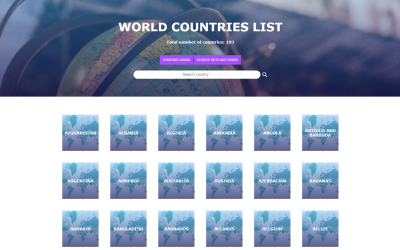

<h1>Filtre os nomes dos países</h1>

<h2 align="left">Objetivo</h2>

 
Filtre os países da lista pelas letras iniciais ou por letras que compõem o nome.

<h2 align="left">Descrição</h2>

 
Projeto desenvolvido de forma autônoma durante a realização do desafio <strong>30DaysOfJavaScript</strong>, com o objetivo de replicar um programa, com base em um gif que indicou como ele deveria ser e funcionar.
O programa, assim como o exemplo a ser seguido, foi desenvolvido somente para dispositivos desktop.

<strong>Conceitos utilizados:</strong>

<ul>
  <li>manipulação de arrays</li>
  <li>formatação de strings</li>
  <li>exportar e importar módulos JavaScript</li>
  <li>creatElement()</li>
  <li>appendChild()</li>
  <li>removeChild()</li>
  <li>getElementsById()</li>
  <li>addEventListener()</li>
  <li>forEach()</li>
</ul>

<h2 align="left">Ferramentas</h2>

Linguagens/ferramentas utilizadas:

